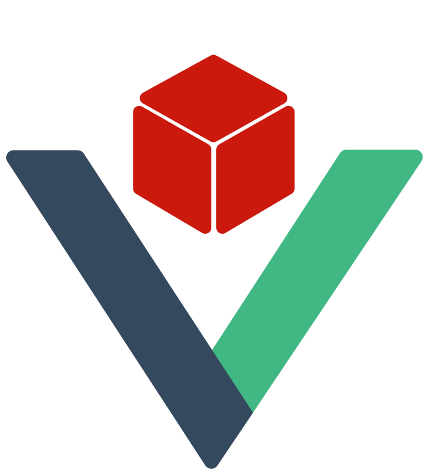

# Laravue - Community Platform for Laravel & Vue.js Developers

<p align="center">
  
</p>

<p align="center">
  <strong>A comprehensive community platform for Laravel and Vue.js developers to connect, collaborate, and grow together.</strong>
</p>

## 🚀 About Laravue

Laravue is a community-based platform designed specifically for Laravel and Vue.js developers to connect, share knowledge, showcase projects, and expand their professional network. Built with modern technologies and best practices, it provides a complete ecosystem for developers to interact, learn, and collaborate.

## ✨ Key Features

### 🔐 Authentication & User Management
- **OTP-based Email Authentication** - Secure login without passwords
- **User Registration & Profile Management** - Complete user profiles with social links
- **Role-based Access Control** - Admin and User roles with appropriate permissions

### 🏠 Homepage & Static Content
- **Dynamic Content Management** - About, Terms & Conditions, Contact, References, Partners, Sponsors, Testimonials
- **Contact Query System** - Store and manage user inquiries in database
- **Responsive Design** - Modern UI with dark/light theme support

### 💼 Project Showcase
- **Project Management** - Add, edit, and showcase projects with rich details
- **Project Types** - Open source, closed source, and sellable projects
- **Technology Stack** - Tag-based technology filtering for easy discovery
- **Project Funding** - Crowdfunding support for innovative projects
- **Advanced Filtering** - Filter by type, popularity, technology stack
- **Upvoting System** - Community-driven project ranking

### 📱 Social Feed
- **Developer Profiles** - Comprehensive developer portfolios with badges
- **Follow System** - Follow developers across different sections
- **Post Management** - Create, edit, and manage posts with AI assistance
- **Rich Content** - Support for hashtags, bookmarks, views, likes, comments
- **Advanced Features** - Repost, comment threading, bookmarking, sharing
- **Content Moderation** - Report system for posts and developers
- **Smart Recommendations** - AI-powered content discovery

### ❓ Q&A Platform
- **Stack Overflow Integration** - Scrape and display relevant questions
- **GitHub Integration** - Connect with GitHub repositories and issues
- **Question Management** - CRUD operations for questions and answers
- **Voting System** - Upvote/downvote questions and answers
- **AI-Powered Answers** - Get intelligent answers with developer and project linking
- **Advanced Search** - Powerful search with trending and personalized feeds

### 📝 Blog System
- **Blog Management** - Create and manage developer blogs
- **AI Writing Assistant** - AI-powered content creation
- **Subscription System** - Follow and subscribe to developer blogs
- **Interactive Features** - Comments, likes, and social sharing

## 🛠️ Technology Stack

### Backend
- **Laravel 11** - Modern PHP framework with latest features
- **Laravel Passport** - OAuth2 authentication system
- **Spatie Media Library** - Advanced media management
- **Spatie Sluggable** - SEO-friendly URL generation
- **MySQL/PostgreSQL** - Robust database support

### Frontend
- **Vue.js 3** - Progressive JavaScript framework with Composition API
- **Vue Router 4** - Client-side routing
- **Pinia** - State management with persistence
- **Tailwind CSS** - Utility-first CSS framework
- **Vite** - Fast build tool and dev server

### Additional Features
- **Markdown Support** - Rich text editing with markdown
- **Real-time Updates** - Live notifications and updates
- **Responsive Design** - Mobile-first approach
- **Dark/Light Themes** - User preference support
- **Internationalization** - Multi-language support ready

## 🚀 Quick Start

### Prerequisites
- PHP 8.4+
- Composer
- Node.js 18+
- MySQL/PostgreSQL

### Installation

1. **Clone the repository**
   ```bash
   git clone <repository-url>
   cd laravue
   ```

2. **Install PHP dependencies**
   ```bash
   composer install
   ```

3. **Install Node.js dependencies**
   ```bash
   npm install
   ```

4. **Environment setup**
   ```bash
   cp .env.example .env
   php artisan key:generate
   ```

5. **Database setup**
   ```bash
   php artisan migrate
   php artisan db:seed
   ```

6. **Build assets**
   ```bash
   npm run build
   ```

7. **Start development server**
   ```bash
   php artisan serve
   npm run dev
   ```

### Development Commands

```bash
# Start all services (server, queue, logs, vite)
composer run dev

# Run tests
php artisan test

# Clear caches
php artisan optimize:clear
```

## 📁 Project Structure

```
laravue/
├── app/                    # Laravel application logic
│   ├── Http/             # Controllers, Requests, Resources
│   ├── Models/           # Eloquent models
│   ├── Services/         # Business logic services
│   └── Repositories/     # Data access layer
├── resources/js/         # Vue.js frontend
│   ├── components/       # Vue components
│   ├── views/           # Page components
│   ├── stores/          # Pinia state management
│   └── composables/     # Vue composables
├── database/            # Migrations, seeders, factories
└── routes/              # API and web routes
```

## 🔧 Configuration

### Key Configuration Files
- `.env` - Environment variables
- `config/auth.php` - Authentication settings
- `config/database.php` - Database configuration
- `tailwind.config.js` - Tailwind CSS configuration
- `vite.config.js` - Vite build configuration

## 🤝 Contributing

We welcome contributions from the community! Please read our contributing guidelines and submit pull requests for any improvements.

### Development Workflow
1. Fork the repository
2. Create a feature branch
3. Make your changes
4. Add tests if applicable
5. Submit a pull request

## 📄 License

This project is open-sourced software licensed under the [MIT license](https://opensource.org/licenses/MIT).

## 🆘 Support

- **Documentation**: Check the project wiki for detailed guides
- **Issues**: Report bugs and feature requests on GitHub
- **Discussions**: Join community discussions for help and ideas

## 🌟 Features Roadmap

- [ ] Advanced AI integration for content generation
- [ ] Real-time chat and collaboration tools
- [ ] Advanced analytics and insights
- [ ] Mobile app development
- [ ] API rate limiting and optimization
- [ ] Enhanced security features
- [ ] Performance monitoring and optimization

---

**Built with ❤️ by the Laravel & Vue.js community**
